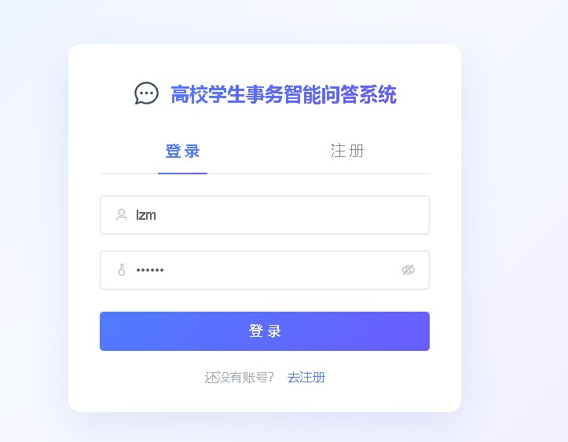
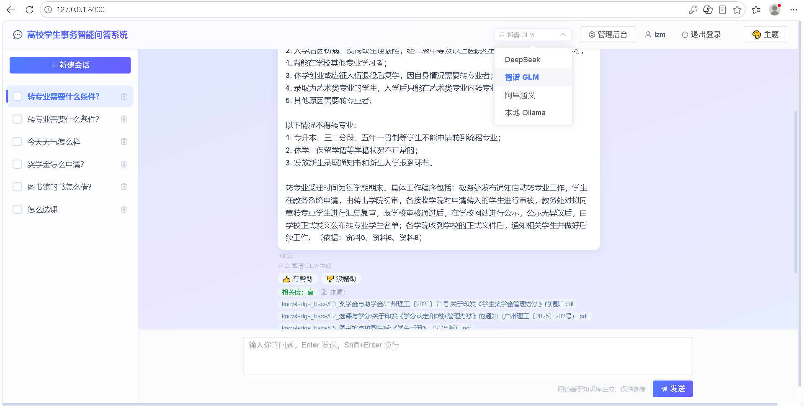
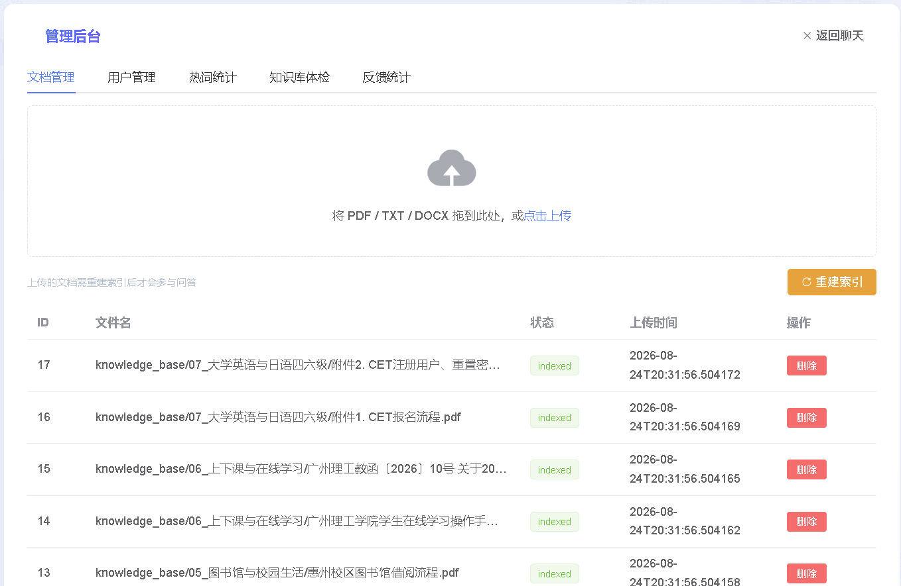
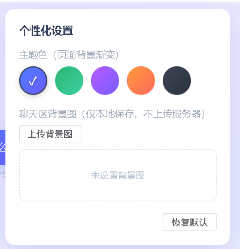

# 高校学生事务智能问答系统 🎓

<div align="center">

**基于大语言模型与向量检索的校园政策智能问答平台**

[](https://www.python.org/)
[](https://fastapi.tiangolo.com/)
[](https://vuejs.org/)
[](https://github.com/facebookresearch/faiss)
[](https://www.docker.com/)
[](LICENSE)
[]()

*学生查政策总是一头雾水？让 AI 基于学校真实政策文件，给出**带来源、可追溯**的回答。*

</div>

---

## ✨ 项目简介

这是一个**检索增强生成（RAG）**问答系统：管理员上传学校政策文件（转专业、奖学金、学籍、四六级等），学生用自然语言提问，系统从知识库检索最相关的政策条款，让大模型**只依据检索内容**生成回答，并自动标注来源。

**解决的核心问题**：通用大模型不知道学校内部政策、容易一本正经地编造（幻觉）；传统关键词搜索找不到"白话问题"对应的公文条款。本系统通过"混合检索 + 强制引用 + 兜底引导"三件套，让回答**可溯源、可更新、不编造**。

## 🌟 核心特性

| 特性            | 说明                                                                          |
| ------------- | --------------------------------------------------------------------------- |
| 🔍 **混合检索**   | BM25 关键词 + 向量语义双路召回，RRF 加权融合；实测命中率 93%（纯向量仅 24%）                            |
| 📎 **引用标注**   | 回答逐句标注"（依据：资料N）"，前端展示来源文档，杜绝凭空捏造                                            |
| 🧠 **智能兜底**   | 检索不到时不再冷冰冰拒绝：三段式回复（致歉说明 + 主题引导 + 问法建议），13 主题关键词表 + 4 类问法模板                  |
| 💬 **多轮对话**   | 指代消解式查询扩展——"那流程是什么？"能自动关联上一轮的"转专业"                                          |
| 🎭 **多模型可插拔** | OpenAI 兼容协议 + 注册表设计：DeepSeek / 智谱 GLM / 通义 / Kimi / 硅基流动 / 本地 Ollama，前端一键切换 |
| 📄 **多格式知识库** | PDF / TXT / DOCX（含表格），扫描版 PDF 自动 OCR（RapidOCR），按主题文件夹组织                     |
| ⚡ **流式输出**    | SSE 打字机效果，回答边生成边展示                                                          |
| 👍 **反馈闭环**   | 回答点赞/点踩 + 原因统计；知识库体检（命中次数、僵尸文档）                                             |
| 🎨 **个性化界面**  | 主题色板、自定义背景图、相关度徽章（高/中/低）、推荐追问                                               |
| 🛡️ **安全设计**  | JWT 认证、bcrypt 密码哈希、admin 权限隔离、API Key 全程不进代码不进镜像                            |
| 🐳 **一键部署**   | Docker 容器化：任何机器装 Docker 后双击脚本即可运行                                           |

## 📸 界面预览

<div align="center">

| 登录注册 | 智能问答 |
|:---:|:---:|
|  |  |

| 智能兜底与推荐追问 | 管理后台 | 主题面板 |
|:---:|:---:|:---:|
|  |  |  |


## 🏗️ 系统架构

```
┌─────────────── 浏览器（Vue3 单文件前端） ───────────────┐
│  登录/聊天/流式/来源标注/模型切换/管理后台/主题面板      │
└──────────────────────────┬─────────────────────────────┘
                           │ HTTP + SSE
┌──────────────────────────▼─────────────────────────────┐
│                    FastAPI 后端                          │
│  auth(注册/登录/JWT)  chat(会话/流式/反馈/推荐)          │
│  admin(文档/用户/热词/体检)   qa(RAG 核心)               │
│                                                         │
│  RAG 链路：                                              │
│  问题 → 指代消解 → 混合检索(BM25+向量, RRF融合)         │
│       → Prompt组装(资料+历史) → LLM生成(带引用标注)     │
│                                                         │
│  存储：SQLite(4表) + FAISS索引 + BM25词频(索引pkl)      │
└──────────┬──────────────────────────────┬──────────────┘
           │ OpenAI 兼容 API               │
    ┌──────▼──────┐  ┌──────────┐  ┌──────▼──────┐
    │ DeepSeek    │  │ 智谱/通义 │  │ 本地 Ollama  │
    │ (默认)      │  │ Kimi...  │  │ (离线)      │
    └─────────────┘  └──────────┘  └─────────────┘
```

## 🔧 技术栈

| 层     | 技术                              | 用途            |
| ----- | ------------------------------- | ------------- |
| 前端    | Vue3 + Element Plus（CDN 单文件）    | 界面与交互，零构建工具链  |
| 后端    | Python 3.11 / FastAPI / Uvicorn | API 服务、SSE 流式 |
| 数据库   | SQLite + SQLAlchemy 2.0         | 用户/会话/消息/文档   |
| 向量检索  | FAISS（IndexFlatL2 + L2 归一化）     | 语义相似度检索       |
| 关键词检索 | BM25（jieba 分词）                  | 条款型文本精确命中     |
| 融合    | 加权 RRF（Reciprocal Rank Fusion）  | 双路检索结果融合      |
| 嵌入模型  | BAAI/bge-m3（硅基流动 API）           | 文本向量化（1024 维） |
| 大模型   | OpenAI 兼容协议（6 平台可插拔）            | 回答生成、推荐追问     |
| 文档解析  | pypdf / python-docx / RapidOCR  | PDF/DOCX/扫描件  |
| 部署    | Docker / Docker Compose         | 一键部署、数据卷持久化   |

## 🚀 快速开始（本地运行）

### 前置要求

- Python 3.10+（推荐 3.11）
- [DeepSeek API Key](https://platform.deepseek.com)（对话模型）
- [硅基流动 API Key](https://siliconflow.cn)（嵌入模型 bge-m3，注册送免费额度）

### 安装与启动

```bash
# 1. 进入后端目录
cd backend

# 2. 创建虚拟环境并安装依赖
python -m venv venv
venv\Scripts\activate        # Windows；Linux/Mac: source venv/bin/activate
pip install -r requirements.txt

# 3. 配置 API Key（复制模板后填入自己的 Key）
copy .env.example .env       # 编辑 .env，填入 DEEPSEEK_API_KEY 和 EMBEDDING_API_KEY

# 4. 初始化数据库
python init_db.py

# 5. 启动服务
uvicorn main:app --reload
```

浏览器打开 **http://127.0.0.1:8000** → 注册账号 → 管理后台（`python create_admin.py` 创建管理员）上传政策文档 → 重建索引 → 开始提问。

## 🤖 多模型配置（可选）

系统通过 OpenAI 兼容协议实现模型可插拔，换模型**零代码改动**。在 `.env` 中填入对应平台 Key，前端顶栏下拉框即可切换：

| 厂商           | 模型             | 注册地址                       | 特点       |
| ------------ | -------------- | -------------------------- | -------- |
| DeepSeek（默认） | deepseek-chat  | platform.deepseek.com      | 中文强、便宜   |
| 智谱           | glm-4-flash    | open.bigmodel.cn           | **免费**额度 |
| 阿里通义         | qwen-plus      | bailian.console.aliyun.com | 送额度      |
| Kimi         | moonshot-v1-8k | platform.moonshot.cn       | 长文本      |
| 硅基流动         | DeepSeek-V3 等  | siliconflow.cn             | 模型多      |
| 本地 Ollama    | qwen2.5:7b     | ollama.com                 | **离线免费** |

```ini
# .env 示例（只填你想用的）
LLM_PROVIDER=deepseek          # 默认模型开关
ZHIPU_API_KEY=sk-xxx           # 智谱
DASHSCOPE_API_KEY=sk-xxx       # 通义
OLLAMA_BASE_URL=http://localhost:11434/v1   # 本地 Ollama
```

> 🔒 **Key 安全**：Key 仅保存在本地 `.env`（已被 git 忽略），通过环境变量注入，不进入代码与镜像。

## 📊 评测数据

基于 67 条真实校园政策问答的评测集（覆盖 10 个主题）：

**检索方式对比（DeepSeek，chunk=400，人工评分 1-5）**

| top_k | 检索方式     | 平均相关性    | 平均忠实度 |
| ----- | -------- | -------- | ----- |
| 8     | 纯向量      | 1.23     | 4.82  |
| **8** | **混合检索** | **3.92** | 4.48  |
| 5     | 混合检索     | 2.29     | 4.52  |

**多模型对比（混合检索 k=8）**

| 模型           | 平均相关性 | 平均忠实度 |
| ------------ | ----- | ----- |
| 通义 qwen-plus | 4.07  | 4.46  |
| 智谱 GLM-flash | 4.02  | 4.25  |
| DeepSeek     | 3.92  | 4.48  |

**性能**：平均回答耗时 2.5 秒/题。

> 有趣的现象：纯向量检索忠实度"虚高"（4.8+）——因为大部分问题检索不到内容、走了兜底（不编造），但相关性几乎为零。这说明"诚实但答不出"不是好问答系统，混合检索才是正解。

## 🐳 Docker 一键部署

任何装有 Docker 的机器（Windows/Mac/Linux），无需安装 Python：

```bash
# 1. 复制项目文件夹，编辑 backend/.env 填入 API Key
# 2. 一键启动
docker compose up -d --build
# Windows 也可直接双击 start-docker.bat
```

启动后访问 http://localhost:8000。数据（SQLite/知识库/索引）保存在 Docker 卷 `campus_data` 中，升级镜像不丢数据。详见 [部署说明](部署说明.md)。

## 📁 项目结构

```
campus-qa/
├── backend/
│   ├── main.py              # FastAPI 入口
│   ├── config.py            # 配置中心（多模型注册表、RAG 参数、主题词表）
│   ├── models.py            # 4 张表 ORM
│   ├── auth/                # 注册/登录/JWT
│   ├── chat/                # 会话/消息/流式/反馈/推荐
│   ├── admin/               # 文档/用户/热词/体检
│   ├── qa/
│   │   ├── embeddings.py    # 嵌入模型封装
│   │   ├── knowledge_base.py # 解析/分块/OCR
│   │   ├── vector_store.py  # FAISS + BM25 混合检索
│   │   └── qa_handler.py    # RAG 全流程/兜底/推荐/指代消解
│   ├── evaluate.py          # 评测脚本（--mode/--provider）
│   └── perf_test.py         # 性能测试
├── frontend/index.html      # Vue3 单文件前端
├── Dockerfile / docker-compose.yml
└── 部署说明.md
```

## ❓ 常见问题

| 问题                      | 解决                                             |
| ----------------------- | ---------------------------------------------- |
| 提问返回"未找到相关内容"           | 检查是否已上传文档并**重建索引**（管理后台）；扫描件需等待 OCR 完成         |
| 切换模型后报错                 | 检查 `.env` 中对应平台 Key 是否已填、服务是否开通                |
| 改参数不生效                  | 改 `CHUNK_SIZE` 等分块参数后必须重建索引；`TOP_K` 无需重建       |
| Docker 容器内用不了 Ollama    | 宿主机 Ollama 需用 `host.docker.internal` 访问（见部署说明） |
| Windows 下 faiss 报中文路径错误 | 本项目已用 serialize 方案规避，升级 faiss 版本时注意            |

## 📄 说明

本项目为《基于大语言模型与向量检索的高校学生事务智能问答系统设计与实现》，代码仅供学习交流。知识库中的政策文件版权归原发布单位所有。

代码基于 [MIT License](LICENSE) 开源，欢迎 Star ⭐ 与 Issue 交流。
